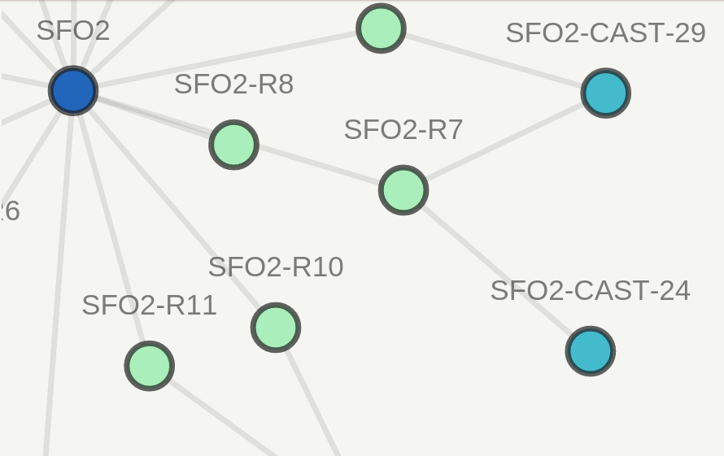

aspath_graph
============

``aspath_graph`` converts raw ASPATHs to NetJSON Graph

.. image:: http://www.wtfpl.net/wp-content/uploads/2012/12/wtfpl-badge-2.png
   :target: http://www.wtfpl.net/
   :alt: Do what the fuck you want
   :height: 25px

NetJSON_ is a series of JSON schema for defining networks, `NetJSON Graph`_
being specific to defining how nodes interconnect. "aspath_graph" uses
this to represent BGP autonomous systems as 'nodes' and how they connect
from the perspective of INPUT

.. _NetJSON: http://netjson.org/
.. _NetJSON Graph: https://github.com/interop-dev/netjsongraph.js

This project aims to make it easy to go from BGP AS PATHs in their raw form to
something NetJSON Graph understands. This makes it easy to add properties to
nodes based on their label or ASN and display/handle them differently on the
frontend in CSS/JS/HTML.

* Contents:

  + 1 aspath_graph_

    + 1.1 Quickstart_
    + 1.2 `Embedding In Existing Webpages`_
    + 1.3 Usage_

Quickstart
----------

For a really quick start, clone the repo and check out the examples folder. It
has a paths text-file for how I saw PATHs to 1.0.0.0/12+ at the time.

For your own data, there are two input methods currently:

1. netconf to Junos devices
2. Plain text file of ASPATHs

Good news is that the second one is very flexible. Here are a few ways you can
create it:

.. code:: bash

    birdc 'show route table <name> all'|grep BGP\.as_path|egrep -o '[0-9]+ [0-9 ]+' > aspaths.txt

.. code:: bash

    ssh junosrtr "show route protocol bgp | match \"AS path\"" | sed -e 's/.*AS path: //g' > aspaths.txt

Embedding In Existing Webpages
------------------------------

NetJSON Graph is pretty simple to embed into existing pages and theme, thus so
is getting your AS nodes there. I'll refer you to the README and docs for the
main project, but below is a small example.

.. code-block:: html

    <!DOCTYPE html>
    <html>
    <head>
        <meta charset="utf-8">
        <link href="https://rawgit.com/interop-dev/netjsongraph.js/master/src/netjsongraph.css" rel="stylesheet">
        <link href="https://rawgit.com/interop-dev/netjsongraph.js/master/src/netjsongraph-theme.css" rel="stylesheet">
    </head>
    <body>
    

        

            <!-- Nav stuff... -->
        

        
 <!-- Imagine this your usual main container -->

            <!-- You probably have several things down here... -->
            

                <!-- You can even add a legend, there's an example on the main project site -->
            

            

        

    

    
    
    
    </body>
    </html>

Usage
-----

.. code::

    $ aspath_graph --help    Usage: aspath_graph [OPTIONS] INPUT

    Options:
      -v, --version                   Show the version and exit.
      -m, --mode [junos-netconf|txt]  Mode to use
      -o, --output FILENAME           Output file
      --asdot                         Whether to add ASDOT notation
      --ownas TEXT                    Apply perspective of own AS at the beginning
                                      of PATHS
      --runserver                     Run local server on 8000
      --user TEXT                     Only used for relevant modes
      --nopassword                    If using a login mode, this will enable
                                      public key auth
      --yaml FILENAME                 YAML for mapping and ignoring ASes
      --pprint                        Pretty print JSON
      -h, --help                      Show this message and exit.

INPUT can either be a device or file depending on value of MODE. This
defaults to a file. (txt)

OUTPUT can be '-' to send results to STDOUT.

If not passing '--nopassword', you will be prompted for a password for the
relevant modes.

When using "--asdot" to provide ASDOT notation, the raw ASPLAIN will also
be provided on the node - just under the "raw" attribute.

YAML can be formatted as such: (Note that "ignore" must ONLY be ASPLAIN)

.. code:: yaml

    label_map:
        65001: SFO
        65002: ORD
        65003: NYC
        65003.1: NYC-R1
        65003.2: NYC-R2

    ignore:
        - 7224
        - 9059

By default, ASDOT will be labeled according to the firsthalf. Eg, if 65001
is configured to be labeled as DFW, 65001.211 will appear as DFW-R21. This
assumes your ToR ASN is your spine ASN + (racknumber*10+1) - to disable
this simply set APG_ASDOT_RAW to true/yes/anything.

Any of the supported options can be passed via ENV by upping the case,
replacing '-' with '_', and prefixing with 'APG'. Eg, 'APG_MODE'
